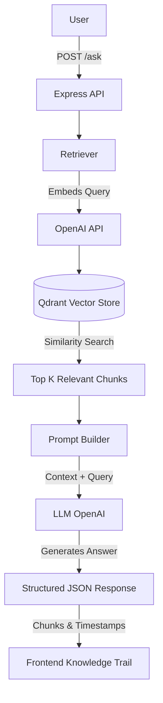
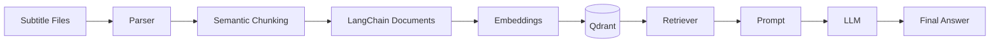

# Advanced RAG Pipeline

The Advanced RAG Pipeline is a sophisticated Retrieval-Augmented Generation system designed specifically for extracting, querying, and synthesizing knowledge from course subtitle files. By leveraging semantic chunking and a robust vector database, this system allows users to ask complex questions and receive accurate, grounded answers directly attributed to the exact video lessons and timestamps.

<!-- Banner Placeholder:  -->

## Features

- **Semantic Chunking**: Breaks down transcripts based on meaning rather than arbitrary character counts, ensuring context is preserved.
- **Hybrid Prompting**: Instructs the LLM using a precise prompt structure that forces it to answer strictly based on the provided context.
- **Grounded Responses**: Completely eliminates out-of-bounds answers by utilizing fallback states and hallucination prevention logic.
- **Qdrant Vector Database**: High-performance similarity search for instantly retrieving the most relevant chunks.
- **OpenAI Embeddings**: Converts raw text into dense vector representations for accurate semantic matching.
- **Knowledge Trail UI**: A highly visual, chronological trace of exactly which lessons and timestamps were used to construct the answer.
- **Dynamic Retrieval Visualization**: A sleek SVG-based animation that visualizes the data flow from the retriever to the LLM and out to the timeline branches.
- **Lesson & Timestamp Attribution**: YouTube-style timestamps and direct lesson mapping embedded cleanly into the UI.
- **Responsive Interface**: Handcrafted, premium "engineering visualization" aesthetic built with Vanilla JS and CSS variables (no bloated frameworks).
- **Express API**: A lightweight routing layer that exposes the underlying RAG pipeline via standard HTTP requests.

## Architecture



## Project Structure

The project was intentionally designed with a strict modular hierarchy to separate the RAG logic from the web transport layer.

- `parser/`: Reads and cleans raw SRT/VTT subtitle files, extracting precise timestamp and lesson metadata.
- `chunker/`: Houses the semantic chunking algorithms that process parsed transcripts into logical, embedding-ready segments.
- `embeddings/`: Manages the instantiation of the OpenAI embedding model.
- `retriever/`: Orchestrates the similarity search against the vector database to fetch relevant documents.
- `prompts/`: Contains the highly engineered hybrid prompts used to instruct the LLM.
- `vectorstore/`: Handles the Qdrant client connection and collection management.
- `llm/`: Wraps the OpenAI chat model configuration.
- `ingest/`: Standalone pipeline for batch-processing and upserting `.srt` files into Qdrant.
- `routes/`: Express router definitions connecting the HTTP endpoints to the RAG logic.
- `public/`: The vanilla HTML, CSS, and JS modular frontend.

## Data Flow



## Tech Stack

| Category | Technology |
|---|---|
| **Language** | JavaScript (Node.js) |
| **Framework** | Express.js |
| **Embedding Model** | OpenAI `text-embedding-3-small` |
| **LLM** | OpenAI `gpt-3.5-turbo` |
| **Vector Database** | Qdrant (Cloud) |
| **Backend** | LangChain JS |
| **Frontend** | HTML5, CSS3, Vanilla JS |
| **Authentication** | Clerk |
| **Deployment** | Render / Railway |

## Design Decisions

- **Why Express?** We needed a lightweight way to expose the already-complete RAG pipeline to a web interface without the overhead of a massive meta-framework. Express fits perfectly as a simple transport layer.
- **Why NOT EJS?** Server-side rendering would disrupt the premium, asynchronous frontend experience. By serving a static frontend and communicating via JSON APIs, we unlock fluid animations and dynamic DOM updates.
- **Why plain HTML/CSS/JS?** To ensure absolute control over the DOM and performance. The dynamic SVG paths (`svgFlow.js`) require highly specific DOM manipulation that is often abstracted away or complicated by React's virtual DOM. 
- **Why preserve modular RAG folders?** Keeping `parser`, `chunker`, and `retriever` separate from `routes` ensures the core RAG logic remains framework-agnostic. It could theoretically be ported to a CLI or another framework in minutes.
- **Why Hybrid Prompting?** Standard prompting often allows the LLM to hallucinate or rely on external knowledge. Hybrid prompting strictly binds the model to the retrieved context and forces a highly structured output format.
- **Why semantic chunking instead of fixed chunking?** Fixed character chunking often slices sentences in half, destroying context. Semantic chunking ensures complete thoughts are embedded together, drastically improving retrieval accuracy.
- **Why lesson/timestamp citations?** Educational tools are useless if users cannot verify the information. Grounding answers in exact timestamps builds trust and allows users to jump straight to the source material.

## Challenges

- **Hallucination Prevention**: Tuning the prompt to gracefully say "The course does not discuss this topic" instead of guessing required significant iteration.
- **Chunk Sizing**: Balancing chunk size for optimal retrieval—too large dilutes the semantic vector, too small loses context. 
- **Multi-document Synthesis**: Ensuring the LLM could stitch together answers spanning multiple different lessons chronologically without losing the thread.
- **UI Architecture**: Dynamically calculating SVG bezier curves based on variable array lengths (`Top K`) to create the Knowledge Trail visualization required custom math and precise timing.

## Future Improvements

- **Step-back Prompting**: Implementing query transformation to handle vague user questions better.
- **HyDE (Hypothetical Document Embeddings)**: Generating a theoretical answer first to improve retrieval alignment.
- **Reranking**: Adding a Cohere reranker between the retriever and the LLM to push the most relevant chunks to the absolute top.
- **Conversation Memory**: Upgrading the pipeline to support multi-turn conversational follow-ups.
- **Streaming Responses**: Streaming the LLM output token-by-token to improve perceived latency.
- **Better Knowledge Trail**: Deep-linking directly to a hosted video player at the exact timestamp.
- **Upload your own course**: A dashboard allowing users to ingest their own `.srt` files dynamically.

## Installation

1. Clone the repository:
   ```bash
   git clone https://github.com/Krizh27/advanced_rag_pipeline.git
   cd advanced_rag_pipeline
   ```
2. Install dependencies:
   ```bash
   npm install
   ```
3. Set up your environment variables (see below).

## Environment Variables

Create a `.env` file in the root directory:

| Variable | Description |
|---|---|
| `OPENAI_API_KEY` | Your OpenAI secret key |
| `QDRANT_URL` | The REST URL for your Qdrant cluster |
| `QDRANT_API_KEY` | The API key for your Qdrant cluster |
| `CLERK_SECRET_KEY` | Backend secret key for Clerk auth |
| `NEXT_PUBLIC_CLERK_PUBLISHABLE_KEY` | Optional frontend publishable key |
| `PORT` | (Optional) Port for the Express server |

## Running the Project

To ingest course data into Qdrant:
```bash
npm run ingest
```

To start the server:
```bash
npm start
```

Navigate to `http://localhost:3000` to interact with the application.

## Screenshots

<!--  -->
<!--  -->
<!--  -->
<!--  -->

## License

ISC

## Author

<!-- [Your Name / Profile Link] -->
