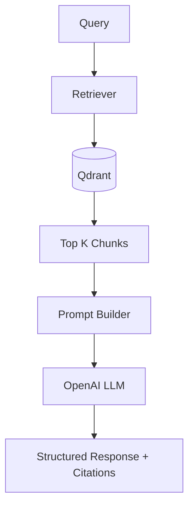

# Advanced RAG Pipeline

The Advanced RAG Pipeline is a sophisticated Retrieval-Augmented Generation system designed for extracting, querying, and synthesizing knowledge from course subtitle files via semantic search.

## Features

- Semantic Chunking for context preservation
- Hybrid Prompting to strictly ground responses
- High-performance Qdrant Vector Database integration
- Modular architectural separation between RAG logic and Express routing
- Fully bespoke, dynamic "Knowledge Trail" UI
- Built-in hallucination prevention mechanisms

## Tech Stack

| Component | Technology |
|---|---|
| **Language** | JavaScript (Node.js) |
| **Framework** | Express.js |
| **Embeddings** | OpenAI `text-embedding-3-small` |
| **LLM** | OpenAI `gpt-3.5-turbo` |
| **Vector DB** | Qdrant |
| **Frontend** | Vanilla JS, HTML, CSS |

## Architecture



## How it Works

- **Ingestion**: Subtitle (`.srt`) files are parsed, stripped of timestamps, and semantically chunked into meaningful documents.
- **Vectorization**: Chunks are embedded using OpenAI and stored in a Qdrant cluster alongside their metadata (lesson name, start time, end time).
- **Retrieval**: User queries are embedded and mapped against the vector database using cosine similarity.
- **Generation**: The top chunks are injected into a highly specific hybrid prompt, forcing the LLM to answer only using the provided context.
- **Visualization**: The Express API returns the answer and the chunks to the frontend, which dynamically renders SVG paths connecting the flow of data into chronological "Knowledge Trail" cards.

## Setup

```bash
git clone https://github.com/Krizh27/advanced_rag_pipeline.git
cd advanced_rag_pipeline
npm install
# Add .env variables (OPENAI, QDRANT, CLERK)
npm start
```

## Highlights

- **Semantic Chunking**: Ensures data retains logical meaning rather than arbitrary character splits.
- **Hybrid Prompt**: Strictly forces the model to cite sources and reject out-of-scope queries gracefully.
- **Grounded Responses**: Prevents hallucination by relying purely on retrieved transcript data.
- **Knowledge Trail**: Provides users with a transparent, visual audit trail of exactly where their answer came from.
- **Lesson & Timestamp Attribution**: Formats and displays exact chronological citations for high verifiability.

## Deployment

- **GitHub Repository**: [Link Placeholder]
- **Live Demo**: [Link Placeholder]

## Notes

This project intentionally maintains a strict separation of concerns. The core RAG pipeline (`parser`, `chunker`, `retriever`, `prompts`) is completely modular and framework-agnostic. It is exposed to the frontend purely through a lightweight Express API layer, preserving a clean boundary between complex retrieval logic and the web interface.
